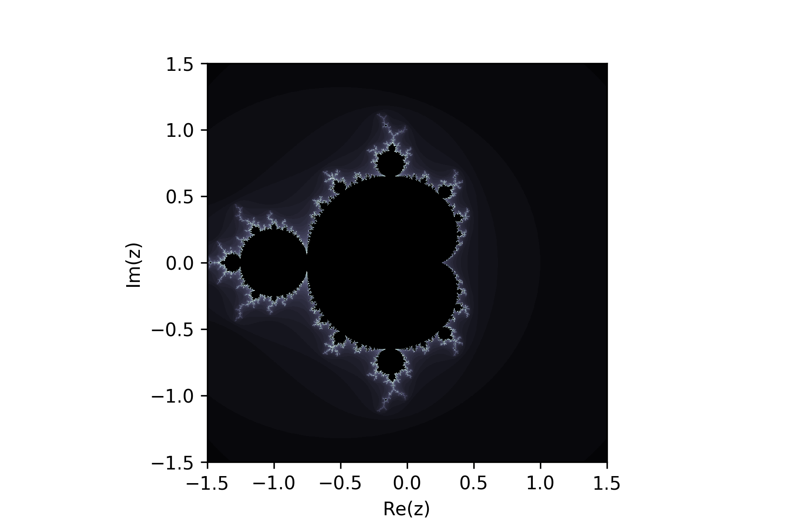

# pyPackageEx
This repository is a simple example of how to package a Python project.

[See the lesson](assets/PackagingAPythonProject.md).

## Installation

Install via command line using [`pip`](https://pip.pypa.io/en/stable/installing/):
```Bash
pip install git+https://github.com/WSParker/pyPackageEx
```
If you plan to locally edit this package, you can run:
```Bash
git clone https://github.com/WSParker/pyPackageEx
cd pyPackageEx
python setup.py develop
```
so that changes to your local copy are reflected immediately.

## Usage
Basically all this package can do is generate Mandelbrot sets and plot them.
```Python
import pyPackageEx as ppe
from pyPackageEx import plotUtils
from pyPackageEx import coords

xmin,xmax,ymin,ymax = -1.5, 1.5, -1.5, 1.5
z = coords.cp(xmin=xmin, xmax=xmax, ymin=ymin, ymax=ymax)
extent = [xmin,xmax,ymin,ymax]

manSet = ppe.mandelbrot(z)
plotUtils.plot(manSet, extent=extent, fname='mandelbrotSet.png', cmap='bone')
```
Output: `mandelbrotSet.png`

