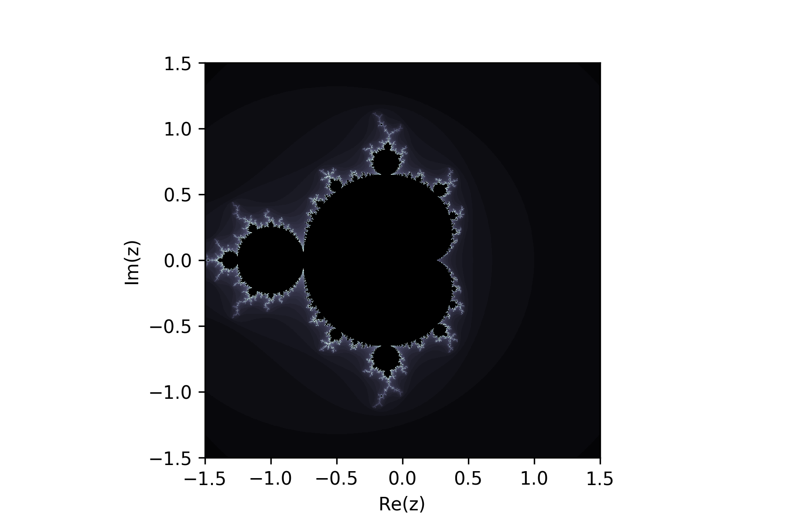

# pyPackageEx
This example package demonstrates how to make a Python package out of individual modules (```.py``` files).

[See the lesson](lib/PackagingAPythonProject.md).

## Installation
```
git clone https://github.com/WSParker/pyPackageEx
cd pyPackageEx
pip install ./
```
If you plan to edit this module, run `python setup.py develop` instead of `pip install ./`.

## Usage
Basically all this package can do is generate Mandelbrot sets and plot them.
```
import pyPackageEx as ppe
from pyPackageEx import plotUtils
from pyPackageEx import coords

xmin,xmax,ymin,ymax = -1.5, 1.5, -1.5, 1.5
z = coords.cp(xmin=xmin, xmax=xmax, ymin=ymin, ymax=ymax)
extent = [xmin,xmax,ymin,ymax]

manSet = ppe.mandelbrot(z)
plotUtils.plot(manSet, extent=extent, fname='mandelbrotSet.png', cmap='bone')
```
Output: `mandelbrotSet.png`

